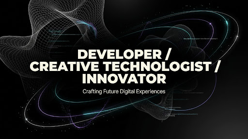

<picture>
  <source media="(prefers-color-scheme: dark)" srcset="public/banner.png">
  
</picture>

<br/>

# Portfolio 2026

**Multiplatform developer portfolio** built with React 18, TypeScript 5, and Vite 5 — featuring 3D scenes, motion-driven interactions, and full i18n support.

[](https://vite.dev)
[](https://react.dev)
[](https://www.typescriptlang.org)
[](https://tailwindcss.com)
[](https://threejs.org)
[](#license)

---

## Overview

A personal portfolio that showcases multiplatform development work through immersive, interactive experiences. The design system uses CSS custom properties for consistent theming, atomic components for maintainability, and motion as a communication layer — not decoration.

## Features

| Capability | Details |
|---|---|
| **3D visuals** | Interactive WebGL scenes via `@react-three/fiber` and `drei` |
| **Motion system** | Framer Motion + GSAP with `prefers-reduced-motion` respect |
| **i18n ready** | Full English and Spanish locales via i18next |
| **Custom cursor** | Magnetic and hover-aware cursor components |
| **Film grain** | Subtle analog texture overlay for visual depth |
| **Type animations** | Text scramble, typewriter, kinetic headlines |
| **Scroll narrative** | Scroll-driven progress, spy, and parallax effects |

## Getting started

```bash
npm install          # Install dependencies
npm run dev          # Start dev server with HMR (http://localhost:5173)
npm run build        # Type-check with tsc, then build to dist/
npm run preview      # Serve the production build locally
```

## Tech stack

| Concern | Choice |
|---|---|
| **UI** | React 18, TypeScript 5 |
| **Build** | Vite 5 |
| **Styling** | Tailwind 4 + CSS custom properties (`tokens.css`) |
| **3D** | Three.js, @react-three/fiber, @react-three/drei |
| **Motion** | Framer Motion, GSAP |
| **Routing** | React Router DOM 6 |
| **i18n** | i18next (locales: `en`, `es`) |

## Project structure

```
src/
├── App.tsx                  # Root composition
├── main.tsx                 # Entry point
├── components/
│   ├── effects/             # BootSequence, CustomCursor, FilmGrain,
│   │                        # KineticHeadline, MagneticButton,
│   │                        # ScrollProgress, TextScramble, TypeWriter
│   ├── sections/            # Hero, About, AboutStack, SelectedWork, Contact
│   ├── three/               # WireframeCentroide
│   └── ui/                  # Button, Card, Tag
├── hooks/                   # useCustomCursor, useHoverSound, useMagneticCursor,
│                            # useReducedMotion, useScrollProgress, useScrollSpy,
│                            # useTextScramble, useTypeWriter
├── i18n/                    # i18next config + locale files
├── lib/                     # Cross-cutting helpers (audio)
└── styles/                  # tokens.css, globals.css, film-grain.css
```

**Atomic design** — folder names tell you what the component does at a glance. Sections compose UI primitives, effects enhance interactions, and hooks encapsulate behavior.

## Design system

All visual primitives (color, type, spacing) live in `src/styles/tokens.css` as CSS custom properties:

```css
--color-bg: #000000;         /* Primary background */
--color-accent: #CCFF00;     /* Brand accent */
--font-sans: 'IBM Plex Sans Variable', sans-serif;
--font-mono: 'JetBrains Mono Variable', monospace;
```

Components consume tokens exclusively — no hard-coded values outside the token file.

## Accessibility

- **Reduced motion**: All animations respect `prefers-reduced-motion` via the `useReducedMotion` hook.
- **Type safety**: The build pipeline runs `tsc` before bundling, so type errors fail the build.
- **Semantic structure**: Components use semantic HTML as the foundation, with motion and effects as enhancements.

## Conventions

- **New section**: Drop a component under `src/components/sections/`, wire it in `App.tsx`, and add copy to both locale files.
- **Non-trivial changes**: Follow the SDD workflow — proposal → spec → design → tasks → apply → verify.

## Author

**Mikel Romero Homobono**
mikelromerohomobono@gmail.com

---

<p align="center">
  <sub>Built with React, Three.js, and way too much caffeine.</sub>
</p>
